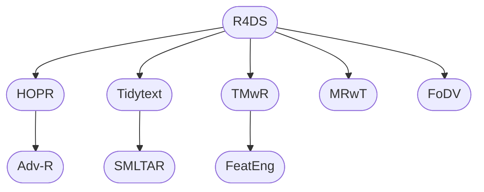
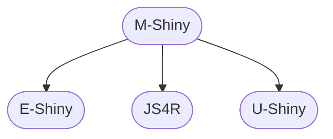
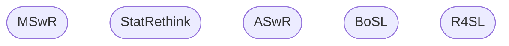
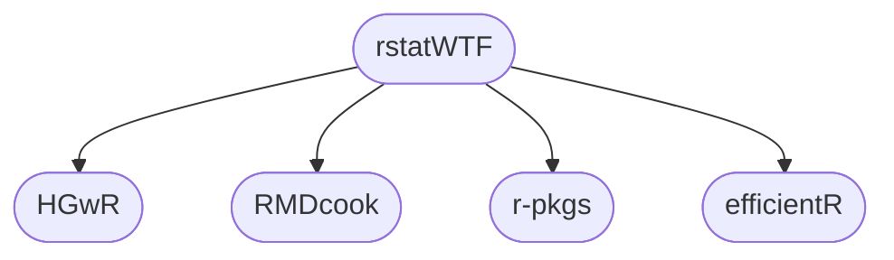

# r-learning-paths
Learning paths for R programmers. You can click on each node for the resource link.

## Books

```mermaid
graph TD
    A1([R4DS])
    A2([HOPR])
    A3([Adv-R])
    A4([Tidytext])
    A5([TMwR])
    A6([FeatEng])
    A7([SMLTAR])
    A8([MRwT])
    A9([FoDV])
    click A1 "https://r4ds.hadley.nz/"
    click A2 "https://jjallaire.github.io/hopr/"
    click A3 "https://adv-r.hadley.nz/"
    click A4 "https://www.tidytextmining.com/"
    click A5 "https://www.tmwr.org/"
    click A6 "http://www.feat.engineering/"
    click A7 "https://smltar.com/"
    click A8 "https://b-rodrigues.github.io/modern_R/"
    click A9 "https://clauswilke.com/dataviz/"
    A1 --> A2
    A2 --> A3
    A1 --> A4
    A1 --> A5
    A5 --> A6
    A4 --> A7
    A1 --> A8
    A1 --> A9
```

```mermaid
graph TD
    B1([M-Shiny])
    B2([E-Shiny])
    B3([JS4R])
    B4([U-Shiny])
    click B1 "https://mastering-shiny.org/"
    click B2 "https://engineering-shiny.org/"
    click B3 "https://book.javascript-for-r.com/"
    click B4 "https://unleash-shiny.rinterface.com/welcome.html"
    B1 --> B2
    B1 --> B3
    B1 --> B4
```

```mermaid
graph TD
    C1([MSwR])
    C2([StatRethink])
    C3([ASwR])
    C4([BoSL])
    C5([R4SL])
    click C1 "https://modernstatisticswithr.com/"
    click C2 "https://xcelab.net/rm/statistical-rethinking/"
    click C3 "https://book.stat420.org/"
    click C4 "https://statisticallearning.org/"
    click C5 "https://daviddalpiaz.github.io/r4sl/"
```

```mermaid
graph TD
    D1([rstatWTF])
    D2([HGwR])
    D3([RMDcook])
    D4([r-pkgs])
    D5([efficientR])
    click D1 "https://rstats.wtf/"
    click D2 "https://happygitwithr.com/"
    click D3 "https://bookdown.org/yihui/rmarkdown-cookbook/"
    click D4 "https://r-pkgs.org/"
    click D5 "https://csgillespie.github.io/efficientR/"
    D1 --> D2
    D1 --> D3
    D1 --> D4
    D1 --> D5
```
